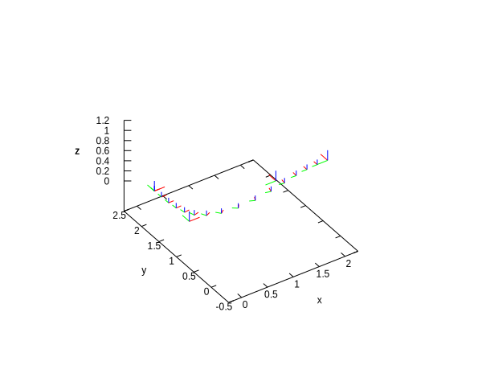

# liespline
Just an example implementation of cubic B-spline interpolation for 3D Euclidean motions (se3).

The following paper inspired me to implement this:
"Continuous-Time Visual-Inertial Odometry for Event Cameras" Elias Mueggler, Guillermo Gallego, Henri Rebecq, and Davide Scaramuzza 

Might be handy someday for Visual-SLAM problems with a high-frequency camera.

The code uses some c++20 features; I used GCC 8.3.0 with `-std=c++2a -fconcepts`.

